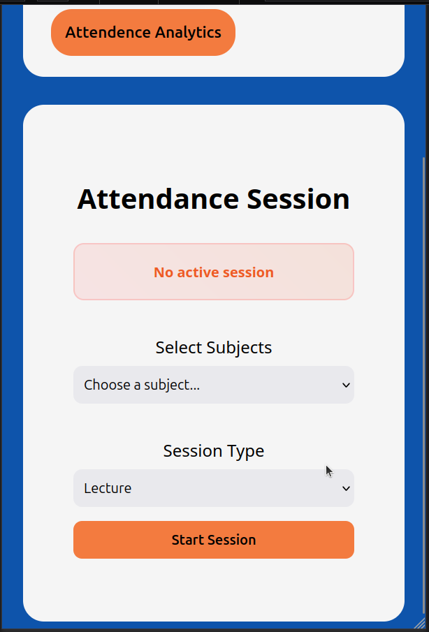
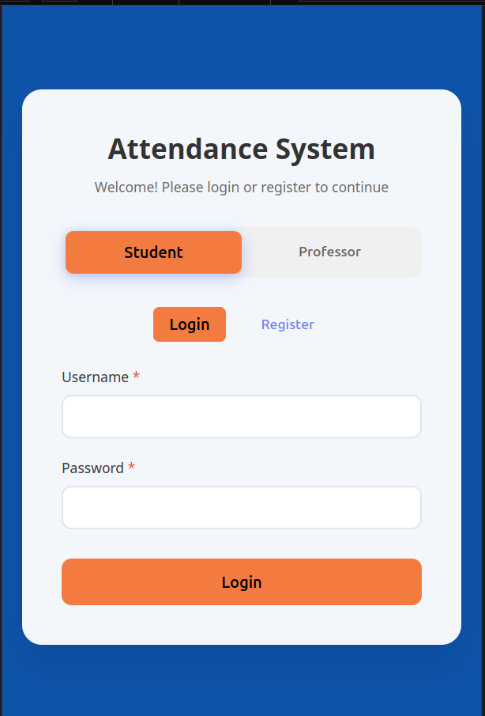
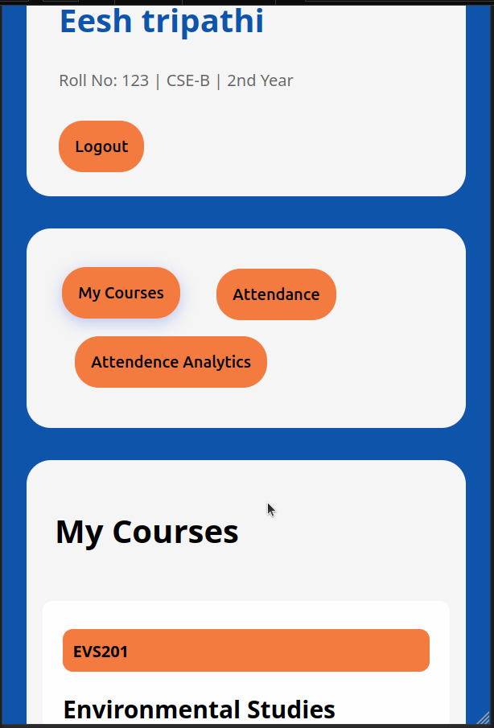

# Attendence App

### Introduction :tada:

Attendence App is a web application which provides a digital interface for logging and management of attendence
for any institution. Digitalizing the common attendence work makes the process easy, fast and accessable, both
on the sides of students and professor. The Application uses following technologies:

|Usage | Technology |
|----|----|
| Frontend | HTML, CSS, JavaScript |
| Backend | [Node.js](https://nodejs.org/en) |
| Encryption and Hashing | [Bcrypt](https://www.npmjs.com/package/bcrypt) |
| Session Management | [Express Session](https://www.npmjs.com/package/express-session) |
| Data Visualisation | [Chart.js](https://www.chartjs.org/)|
| Fonts | <ul><li>Segoe UI</li><li>Tahoma</li><li>Geneva</li><li>Verdana</li><li>sans-serif</li></ul> |

### Features  :rocket:

1. **User Analytics:** Both students and professors gain meaningful insights through visual analytics. Attendance records are presented in easy-to-understand chart, helping users track progress and identify subject where they may need attendence improvement.
2. **Locked Session Feature:** Each session has a strictly limited duration, which prevents unauthorized or late entries. This ensures that only students who are physically present in class can mark their attendance, maintaining the integrity of the records.
3. **Higher Control for Professors:** Professors have full control over incoming attendance requests. They can review, approve, or reject entries before final submission, giving them greater authority to manage their classes and reduce discrepancies.
4. **Minimalistic Interface:** The application’s frontend is designed to be clean, intuitive, and clutter-free. Users can easily navigate through features without wasting time searching for options, making the overall experience smooth and efficient.
5. **User Centeric Design:** Out of all the subjects running in the institution, a particular student only sees the labs, lectures and workshops relevent to his department and year.

### Gallery :rice_scene:

### Follow Up 📝

1. Inculsion of Admin Panel: Providing a way for institution to clean up and manipulate enteries to mitigate human errors and maintain database.
2. Email Service: An *honor score* for each student can be maintained. Which decrements and keeps check for students who send unauthorised enteries. Sending warning
emails to students provide useful way for keeping offenders in check.

### References :bookmark_tabs:

- https://www.chartjs.org/docs/latest/
- https://developer.mozilla.org/en-US/docs/Web/
- https://nodejs.org/docs/latest/api/
